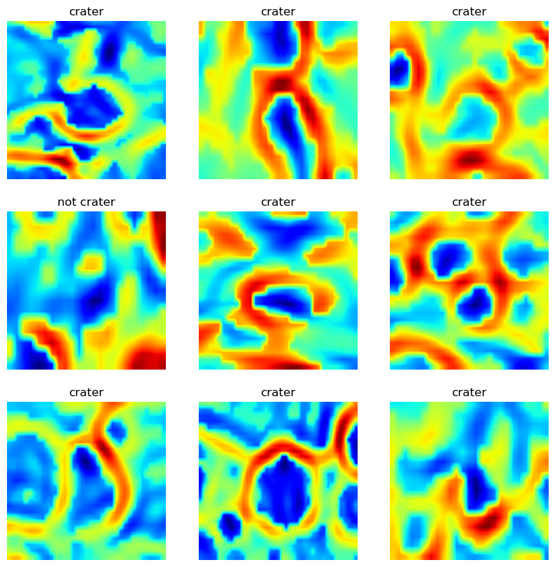

```python
import pandas as pd
import scipy.io as io
import numpy as np
import cv2
import time
import matplotlib.pyplot as plt


```


```python
import boto3

import io
from scipy.io import loadmat

# Create an S3 client
s3 = boto3.client('s3')

# Specify the S3 bucket and file path
bucket_name = 'craterdetection'
file_key = '3100_1km_rscl.mat'

response = s3.get_object(Bucket=bucket_name, Key=file_key)
file_stream = io.BytesIO()
file_stream.write(response['Body'].read())
file_stream.seek(0) # Reset the file pointer to the beginning of the file stream

# Load the file from the stream using scipy.io.loadmat
from_matlab = loadmat(file_stream)

# Access the data from the loaded MATLAB file
eig22 = from_matlab['eig22']

(siz1,siz2) = eig22.shape
```


```python
file_key = 'far_mask.mat'

response = s3.get_object(Bucket=bucket_name, Key=file_key)
file_stream = io.BytesIO()
file_stream.write(response['Body'].read())
file_stream.seek(0) # Reset the file pointer to the beginning of the file stream

# Load the file from the stream using scipy.io.loadmat
from_matlab = loadmat(file_stream)

# Access the data from the loaded MATLAB file
far_mask = from_matlab['far_mask']

```


```python
def coord_to_ind(lat,lon):
    
    
    if (lon > 0) & (abs(lon) > 90):
        jj = round((lon-90)/360*siz2)-1
    else:
        jj = round((lon+270)/360*siz2)-1
   
    
    ii = round((90-lat)/180*siz1)-1
    

    return jj,ii


csv_file_key = 'LolaLargeLunarCraterCatalog.csv'
csv_file_url = f"s3://{bucket_name}/{csv_file_key}"

crater_frame = pd.read_csv(csv_file_url)

cropped_images = []
latss = []
diass = []
```


```python
for i in range(len(crater_frame.Lat)):
    
    lat = crater_frame.Lat[i]
    lon = crater_frame.Lon[i]
    dia = crater_frame.Diam_km[i]
    
    radius = (dia/2)/(1737*2*np.pi*np.cos(lat*np.pi/180))*siz2
    radius+=5
    
    x,y = coord_to_ind(lat, lon)
    
    if far_mask[int(y),int(x)] == 0:
        continue
    
    left = int(max(0, x - 1.5*radius))
    top = int(max(0, y - radius))
    right = int(min(eig22.shape[1], x + 1.5*radius))
    bottom = int(min(eig22.shape[0], y + radius))

    # Crop the image and resize it to a standard size, e.g., 100x100
    cropped_img = cv2.resize(eig22[top:bottom, left:right], (224, 224))

    cropped_images.append(cropped_img)
    latss.append(lat)
    diass.append(dia)
    
```


```python

csv_file_key = 'crater_classifications.xlsx'
csv_file_url = f"s3://{bucket_name}/{csv_file_key}"

df = pd.read_excel(csv_file_url, header=None)


val = df.values

val2 = val.ravel()
y_data = val2.reshape(len(val2),1)

y_data = [int(num - 1) for num in y_data]


print(y_data[:20])
```

    [1, 0, 1, 1, 1, 1, 1, 0, 1, 1, 1, 0, 1, 1, 1, 0, 1, 1, 1, 1]


```python
x_data = cropped_images[:len(val2)]

```


```python
import matplotlib.pyplot as plt
import numpy as np
import os
import tensorflow as tf
import tensorflow.keras.layers as tfl

from tensorflow.keras.preprocessing import image_dataset_from_directory
from tensorflow.keras.layers.experimental.preprocessing import RandomFlip, RandomRotation

tf.random.set_seed(3)
```


```python
import numpy as np
from sklearn.model_selection import train_test_split

# Assuming 'x_data' is your list of images and 'y_data' is your list of labels
x_train, x_val, y_train, y_val = train_test_split(x_data, y_data, test_size=0.2, random_state=77)

# Convert lists to tensors
x_train_tensor = tf.convert_to_tensor(x_train, dtype=tf.float32)
y_train_tensor = tf.convert_to_tensor(y_train, dtype=tf.int32)

x_val_tensor = tf.convert_to_tensor(x_val, dtype=tf.float32)
y_val_tensor = tf.convert_to_tensor(y_val, dtype=tf.int32)

# Create a tf.data.Dataset from the image and label tensors
train_dataset = tf.data.Dataset.from_tensor_slices((x_train_tensor,y_train_tensor))
val_dataset = tf.data.Dataset.from_tensor_slices((x_val_tensor, y_val_tensor))
```


```python
%matplotlib inline
import matplotlib.pyplot as plt

class_names = ['not crater', 'crater']

plt.figure(figsize=(10, 10))
count = 0
for images, labels in train_dataset:
    ax = plt.subplot(3, 3, count + 1)
    plt.imshow(images.numpy(),cmap='jet') # No need to index further into the image
    print(labels)
    plt.title(class_names[labels]) 
    plt.axis("off")
    count+=1
    if count>8:
        break


```

    tf.Tensor(1, shape=(), dtype=int32)
    tf.Tensor(1, shape=(), dtype=int32)
    tf.Tensor(1, shape=(), dtype=int32)
    tf.Tensor(0, shape=(), dtype=int32)
    tf.Tensor(1, shape=(), dtype=int32)
    tf.Tensor(1, shape=(), dtype=int32)
    tf.Tensor(1, shape=(), dtype=int32)
    tf.Tensor(1, shape=(), dtype=int32)
    tf.Tensor(1, shape=(), dtype=int32)


    

    


```python
# Define a function to preprocess the images
def preprocess_images(image, label):
    image = tf.expand_dims(image, axis=-1)  # Add an extra dimension for the color channels
    image = tf.repeat(image, 3, axis=-1)  # Repeat the single channel three times
    image = (image + 70) / (70 + 70) # Normalize pixel values to [0,1]
    label = tf.cast(label, dtype=tf.int32)  # Ensure labels are integers
    label = tf.expand_dims(label, axis=-1)
    return image, label

# Preprocess the images, shuffle, batch, and prefetch the datasets
train_dataset = train_dataset.map(preprocess_images).shuffle(buffer_size=1000).batch(32).prefetch(tf.data.AUTOTUNE)
val_dataset = val_dataset.map(preprocess_images).batch(32).prefetch(tf.data.AUTOTUNE)

```


```python
val_dataset
```


    <PrefetchDataset element_spec=(TensorSpec(shape=(None, 224, 224, 3), dtype=tf.float32, name=None), TensorSpec(shape=(None, 1), dtype=tf.int32, name=None))>


```python
BATCH_SIZE = 32
IMG_SHAPE = (224, 224, 3)
base_model = tf.keras.applications.MobileNetV2(input_shape=IMG_SHAPE,
                                               include_top=True,
                                               weights='imagenet')
```


```python
from tensorflow.keras.applications.mobilenet_v2 import decode_predictions

base_model.trainable = False


```


```python
# UNQ_C1
# GRADED FUNCTION: data_augmenter
def data_augmenter():
    '''
    Create a Sequential model composed of 2 layers
    Returns:
        tf.keras.Sequential
    '''
    ### START CODE HERE
    data_augmentation = tf.keras.Sequential([
    ])
    data_augmentation.add(RandomFlip('horizontal'))
    data_augmentation.add(RandomRotation(0.2))
    
    
    ### END CODE HERE
    
    return data_augmentation
```


```python
# UNQ_C2
# GRADED FUNCTION
def crater_model(input_shape=IMG_SHAPE, data_augmentation=data_augmenter()):
    ''' Define a tf.keras model for binary classification out of the MobileNetV2 model
    Arguments:
        image_shape -- Image width and height
        data_augmentation -- data augmentation function
    Returns:
    Returns:
        tf.keras.model
    '''
    
        
    base_model = tf.keras.applications.MobileNetV2(input_shape=input_shape,
                                                   include_top=False, # <== Important!!!!
                                                   weights='imagenet') # From imageNet
    
    # freeze the base model by making it non trainable
    base_model.trainable = False 

    # create the input layer (Same as the imageNetv2 input size)
    inputs = tf.keras.Input(shape=input_shape) 
    
    # apply data augmentation to the inputs
    x = data_augmentation(inputs)
    
    # data preprocessing using the same weights the model was trained on
    #x = preprocess_input(x)
    
    # set training to False to avoid keeping track of statistics in the batch norm layer
    x = base_model(x, training=False) 
    
    # add the new Binary classification layers
    # use global avg pooling to summarize the info in each channel
    x = tf.keras.layers.GlobalAveragePooling2D()(x)
    # include dropout with probability of 0.2 to avoid overfitting
    x = tf.keras.layers.Dropout(0.2)(x)
        
    # use a prediction layer with one neuron (as a binary classifier only needs one)
    outputs = tfl.Dense(1,activation='sigmoid')(x)
    
    ### END CODE HERE
    
    model = tf.keras.Model(inputs, outputs)
    
    return model
```


```python
model2 = crater_model()
```

    WARNING:tensorflow:Using a while_loop for converting RngReadAndSkip cause there is no registered converter for this op.
    WARNING:tensorflow:Using a while_loop for converting Bitcast cause there is no registered converter for this op.
    WARNING:tensorflow:Using a while_loop for converting Bitcast cause there is no registered converter for this op.
    WARNING:tensorflow:Using a while_loop for converting StatelessRandomUniformV2 cause there is no registered converter for this op.
    WARNING:tensorflow:Using a while_loop for converting ImageProjectiveTransformV3 cause there is no registered converter for this op.
    WARNING:tensorflow:Using a while_loop for converting RngReadAndSkip cause there is no registered converter for this op.
    WARNING:tensorflow:Using a while_loop for converting Bitcast cause there is no registered converter for this op.
    WARNING:tensorflow:Using a while_loop for converting Bitcast cause there is no registered converter for this op.
    WARNING:tensorflow:Using a while_loop for converting StatelessRandomUniformV2 cause there is no registered converter for this op.
    WARNING:tensorflow:Using a while_loop for converting ImageProjectiveTransformV3 cause there is no registered converter for this op.


```python
# UNQ_C3
base_model = model2.layers[1]
base_model.trainable = True
# Let's take a look to see how many layers are in the base model
print("Number of layers in the base model: ", len(base_model.layers))

# Fine-tune from this layer onwards
fine_tune_at = 120

### START CODE HERE

# Freeze all the layers before the `fine_tune_at` layer
for layer in base_model.layers[:fine_tune_at]:
    layer.trainable = False
    
# Define a BinaryCrossentropy loss function. Use from_logits=True
loss_function = tf.keras.losses.BinaryCrossentropy()
# Define an Adam optimizer with a learning rate of 0.1 * base_learning_rate
base_learning_rate = 0.0005 # Please set this to your desired base learning rate
optimizer = tf.keras.optimizers.Adam(learning_rate=0.1 * base_learning_rate)

# Use accuracy as evaluation metric
metrics = ['accuracy']

### END CODE HERE

model2.compile(loss=loss_function,
              optimizer = optimizer,
              metrics=metrics)
```

    Number of layers in the base model:  2


```python
fine_tune_epochs = 20
total_epochs =  fine_tune_epochs

history_fine = model2.fit(train_dataset,
                         epochs=total_epochs,
                         validation_data=val_dataset)
```

    Epoch 1/20
    WARNING:tensorflow:Using a while_loop for converting RngReadAndSkip cause there is no registered converter for this op.
    WARNING:tensorflow:Using a while_loop for converting Bitcast cause there is no registered converter for this op.
    WARNING:tensorflow:Using a while_loop for converting Bitcast cause there is no registered converter for this op.
    WARNING:tensorflow:Using a while_loop for converting StatelessRandomUniformV2 cause there is no registered converter for this op.
    WARNING:tensorflow:Using a while_loop for converting ImageProjectiveTransformV3 cause there is no registered converter for this op.
    WARNING:tensorflow:Using a while_loop for converting RngReadAndSkip cause there is no registered converter for this op.
    WARNING:tensorflow:Using a while_loop for converting Bitcast cause there is no registered converter for this op.
    WARNING:tensorflow:Using a while_loop for converting Bitcast cause there is no registered converter for this op.
    WARNING:tensorflow:Using a while_loop for converting StatelessRandomUniformV2 cause there is no registered converter for this op.
    WARNING:tensorflow:Using a while_loop for converting ImageProjectiveTransformV3 cause there is no registered converter for this op.
    9/9 [==============================] - 23s 2s/step - loss: 0.8210 - accuracy: 0.4861 - val_loss: 0.8040 - val_accuracy: 0.4444
    Epoch 2/20
    9/9 [==============================] - 18s 2s/step - loss: 0.7302 - accuracy: 0.5243 - val_loss: 0.7629 - val_accuracy: 0.4861
    Epoch 3/20
    9/9 [==============================] - 18s 2s/step - loss: 0.7290 - accuracy: 0.5417 - val_loss: 0.7323 - val_accuracy: 0.4722
    Epoch 4/20
    9/9 [==============================] - 16s 2s/step - loss: 0.6975 - accuracy: 0.5729 - val_loss: 0.7093 - val_accuracy: 0.5139
    Epoch 5/20
    9/9 [==============================] - 18s 2s/step - loss: 0.6903 - accuracy: 0.5903 - val_loss: 0.6926 - val_accuracy: 0.5417
    Epoch 6/20
    9/9 [==============================] - 16s 2s/step - loss: 0.6317 - accuracy: 0.6389 - val_loss: 0.6807 - val_accuracy: 0.6250
    Epoch 7/20
    9/9 [==============================] - 19s 2s/step - loss: 0.6408 - accuracy: 0.6632 - val_loss: 0.6725 - val_accuracy: 0.6528
    Epoch 8/20
    9/9 [==============================] - 18s 2s/step - loss: 0.6278 - accuracy: 0.6806 - val_loss: 0.6664 - val_accuracy: 0.6806
    Epoch 9/20
    9/9 [==============================] - 18s 2s/step - loss: 0.6230 - accuracy: 0.6771 - val_loss: 0.6613 - val_accuracy: 0.6806
    Epoch 10/20
    9/9 [==============================] - 18s 2s/step - loss: 0.5854 - accuracy: 0.7083 - val_loss: 0.6569 - val_accuracy: 0.6806
    Epoch 11/20
    9/9 [==============================] - 18s 2s/step - loss: 0.6195 - accuracy: 0.7083 - val_loss: 0.6527 - val_accuracy: 0.6806
    Epoch 12/20
    9/9 [==============================] - 18s 2s/step - loss: 0.6063 - accuracy: 0.6840 - val_loss: 0.6479 - val_accuracy: 0.6806
    Epoch 13/20
    9/9 [==============================] - 18s 2s/step - loss: 0.6178 - accuracy: 0.7118 - val_loss: 0.6440 - val_accuracy: 0.6806
    Epoch 14/20
    9/9 [==============================] - 16s 2s/step - loss: 0.5700 - accuracy: 0.7118 - val_loss: 0.6402 - val_accuracy: 0.6806
    Epoch 15/20
    4/9 [============>.................] - ETA: 6s - loss: 0.6445 - accuracy: 0.7266


```python
acc = history_fine.history['accuracy']
val_acc = history_fine.history['val_accuracy']

loss = history_fine.history['loss']
val_loss = history_fine.history['val_loss']
```


```python
plt.figure(figsize=(8, 8))
plt.subplot(2, 1, 1)
plt.plot(acc, label='Training Accuracy')
plt.plot(val_acc, label='Validation Accuracy')
plt.ylim([0, 1])
plt.legend(loc='lower right')
plt.title('Training and Validation Accuracy')

plt.subplot(2, 1, 2)
plt.plot(loss, label='Training Loss')
plt.plot(val_loss, label='Validation Loss')
plt.ylim([0, 1.0])
plt.legend(loc='upper right')
plt.title('Training and Validation Loss')
plt.xlabel('epoch')
plt.show()
```


```python

```
